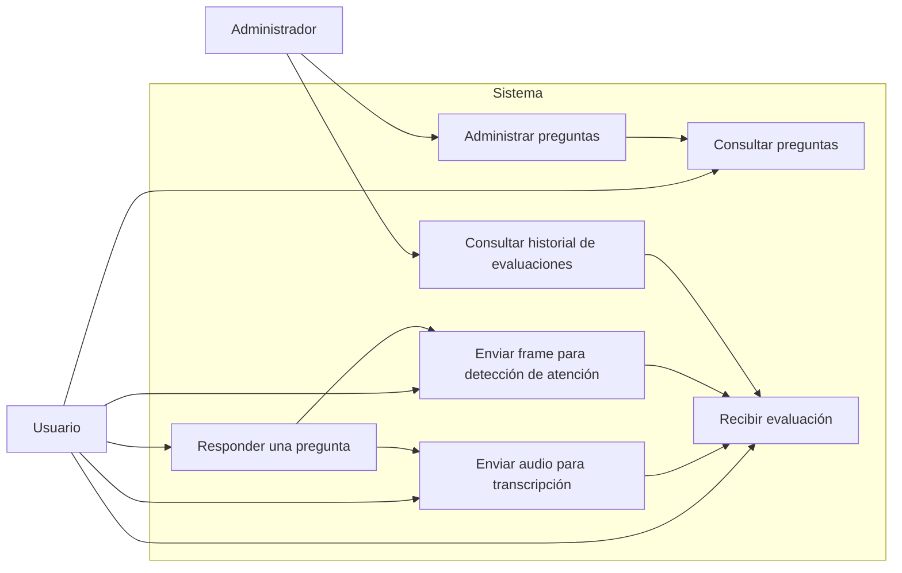

# Diagrama de casos de uso

## Casos de uso principales

- Consultar preguntas disponibles.
- Responder una pregunta mediante audio.
- Transcribir el audio recibido.
- Analizar el frame para detectar atención.
- Evaluar la respuesta y devolver un resultado.
- Administrar preguntas y revisar evaluaciones previas.
