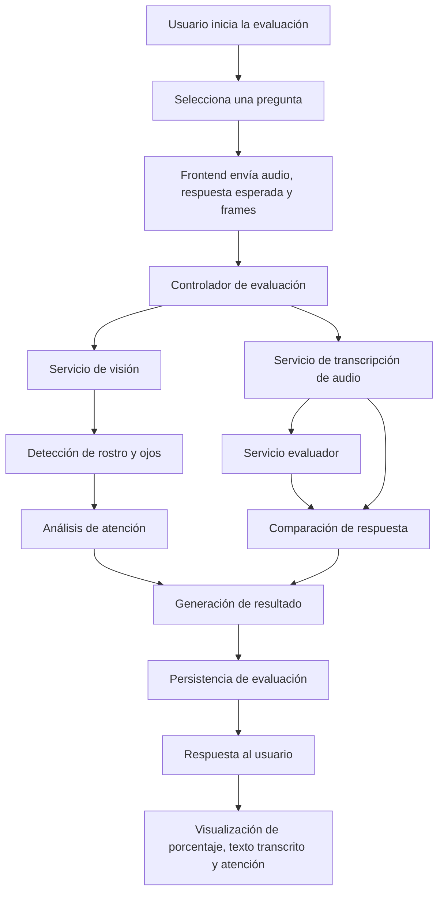

# Diagrama de funcionamiento del sistema

Este diagrama describe el flujo principal del proceso de evaluación de respuestas en el proyecto.

## Descripción breve

1. El usuario inicia una evaluación desde la interfaz.
2. El sistema recibe audio, la respuesta esperada y datos visuales del frame.
3. Se transcribe el audio, se detecta la atención y se compara la respuesta.
4. El resultado se guarda y se devuelve al usuario.
